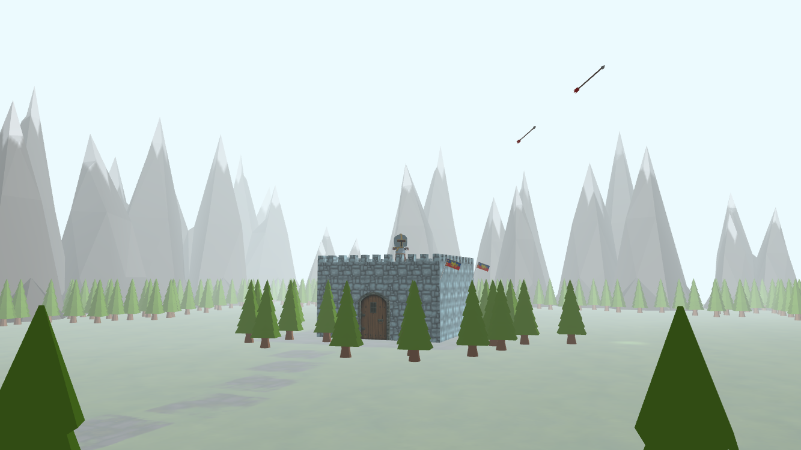

# Castle Defense
College project for computer graphics subject. The game is written in WebGL and vanilla Javascript.

## How to run
Start local server with python:

**Python 2.x** : python -m SimpleHTTPServer

**Python 3.x** : python -m http.server

Wait that all models are loaded and then click start.

Author: Jan Novak, Matej Kristan